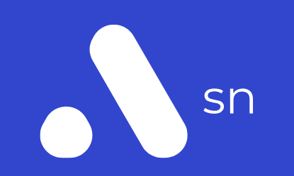

# 'sn is for space'

"sn" curates most used images,logos,gifs and html templates in my workflow for ease of access and smoother development.

### Contributing
> This repository is not meant to a resource list or source code repository. 'sn' holds content related to me(snipc).

## Contents

### [/html](/html/)
> contains html documents.

### [/img](/img/)
> contains logos and background images.

### [/gif](/gif/)
> contains .gif files.

### [/config](/config/)
> contains config files.

### [/docs](/docs/)
> contains documents,js,txt and everything.

### version name: BetterOne
